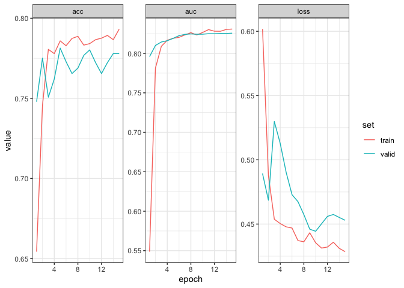

<!-- README.md is generated from README.Rmd. Please edit that file -->


# torchtabular

<!-- badges: start -->

[](https://zenodo.org/badge/latestdoi/378582235)

<!-- badges: end -->

A package for training transformer models on tabular datasets, using
SAINT and TabTransformer variant models in R using {torch}.

## Installation

You can install torchtabular from [GitHub](https://github.com/) with:

``` r
# install.packages("devtools")
devtools::install_github("cmcmaster1/torchtabular")
```

## Example

``` r
library(torchtabular)
library(tidymodels)
library(tidyverse)
library(torch)
library(luz)
library(madgrad)
```

### Check for GPU and assign device

``` r
device <- ifelse(cuda_is_available(), 'cuda', 'cpu')
```

### Load data

The blastchar dataset is included.

``` r
data('blastchar')
glimpse(blastchar)
#> Rows: 7,043
#> Columns: 21
#> $ customerID       <chr> "7590-VHVEG", "5575-GNVDE", "3668-QPYBK", "7795-CFOCW…
#> $ gender           <chr> "Female", "Male", "Male", "Male", "Female", "Female",…
#> $ SeniorCitizen    <dbl> 0, 0, 0, 0, 0, 0, 0, 0, 0, 0, 0, 0, 0, 0, 0, 0, 0, 0,…
#> $ Partner          <chr> "Yes", "No", "No", "No", "No", "No", "No", "No", "Yes…
#> $ Dependents       <chr> "No", "No", "No", "No", "No", "No", "Yes", "No", "No"…
#> $ tenure           <dbl> 1, 34, 2, 45, 2, 8, 22, 10, 28, 62, 13, 16, 58, 49, 2…
#> $ PhoneService     <chr> "No", "Yes", "Yes", "No", "Yes", "Yes", "Yes", "No", …
#> $ MultipleLines    <chr> "No phone service", "No", "No", "No phone service", "…
#> $ InternetService  <chr> "DSL", "DSL", "DSL", "DSL", "Fiber optic", "Fiber opt…
#> $ OnlineSecurity   <chr> "No", "Yes", "Yes", "Yes", "No", "No", "No", "Yes", "…
#> $ OnlineBackup     <chr> "Yes", "No", "Yes", "No", "No", "No", "Yes", "No", "N…
#> $ DeviceProtection <chr> "No", "Yes", "No", "Yes", "No", "Yes", "No", "No", "Y…
#> $ TechSupport      <chr> "No", "No", "No", "Yes", "No", "No", "No", "No", "Yes…
#> $ StreamingTV      <chr> "No", "No", "No", "No", "No", "Yes", "Yes", "No", "Ye…
#> $ StreamingMovies  <chr> "No", "No", "No", "No", "No", "Yes", "No", "No", "Yes…
#> $ Contract         <chr> "Month-to-month", "One year", "Month-to-month", "One …
#> $ PaperlessBilling <chr> "Yes", "No", "Yes", "No", "Yes", "Yes", "Yes", "No", …
#> $ PaymentMethod    <chr> "Electronic check", "Mailed check", "Mailed check", "…
#> $ MonthlyCharges   <dbl> 29.85, 56.95, 53.85, 42.30, 70.70, 99.65, 89.10, 29.7…
#> $ TotalCharges     <dbl> 29.85, 1889.50, 108.15, 1840.75, 151.65, 820.50, 1949…
#> $ Churn            <chr> "No", "No", "Yes", "No", "Yes", "Yes", "No", "No", "Y…
```

### Prepare data

First we will convert the target variable into an integer (0 and 1), and
convert characters to factors so that our tabular dataset will identify
them correctly.

``` r
blastchar <- blastchar %>%
  select(-customerID) %>% 
  mutate(across(c(where(is.character), SeniorCitizen), as_factor),
         Churn = as.numeric(Churn) - 1)

glimpse(blastchar)
#> Rows: 7,043
#> Columns: 20
#> $ gender           <fct> Female, Male, Male, Male, Female, Female, Male, Femal…
#> $ SeniorCitizen    <fct> 0, 0, 0, 0, 0, 0, 0, 0, 0, 0, 0, 0, 0, 0, 0, 0, 0, 0,…
#> $ Partner          <fct> Yes, No, No, No, No, No, No, No, Yes, No, Yes, No, Ye…
#> $ Dependents       <fct> No, No, No, No, No, No, Yes, No, No, Yes, Yes, No, No…
#> $ tenure           <dbl> 1, 34, 2, 45, 2, 8, 22, 10, 28, 62, 13, 16, 58, 49, 2…
#> $ PhoneService     <fct> No, Yes, Yes, No, Yes, Yes, Yes, No, Yes, Yes, Yes, Y…
#> $ MultipleLines    <fct> No phone service, No, No, No phone service, No, Yes, …
#> $ InternetService  <fct> DSL, DSL, DSL, DSL, Fiber optic, Fiber optic, Fiber o…
#> $ OnlineSecurity   <fct> No, Yes, Yes, Yes, No, No, No, Yes, No, Yes, Yes, No …
#> $ OnlineBackup     <fct> Yes, No, Yes, No, No, No, Yes, No, No, Yes, No, No in…
#> $ DeviceProtection <fct> No, Yes, No, Yes, No, Yes, No, No, Yes, No, No, No in…
#> $ TechSupport      <fct> No, No, No, Yes, No, No, No, No, Yes, No, No, No inte…
#> $ StreamingTV      <fct> No, No, No, No, No, Yes, Yes, No, Yes, No, No, No int…
#> $ StreamingMovies  <fct> No, No, No, No, No, Yes, No, No, Yes, No, No, No inte…
#> $ Contract         <fct> Month-to-month, One year, Month-to-month, One year, M…
#> $ PaperlessBilling <fct> Yes, No, Yes, No, Yes, Yes, Yes, No, Yes, No, Yes, No…
#> $ PaymentMethod    <fct> Electronic check, Mailed check, Mailed check, Bank tr…
#> $ MonthlyCharges   <dbl> 29.85, 56.95, 53.85, 42.30, 70.70, 99.65, 89.10, 29.7…
#> $ TotalCharges     <dbl> 29.85, 1889.50, 108.15, 1840.75, 151.65, 820.50, 1949…
#> $ Churn            <dbl> 0, 0, 1, 0, 1, 1, 0, 0, 1, 0, 0, 0, 0, 1, 0, 0, 0, 0,…
```

We can now split the data into train and test sets.

``` r
split <- initial_split(blastchar)
train <- training(split)
valid <- testing(split)
```

By creating a recipe, the `tabular_dataset` function will automatically
recognise categorical (must be factors) and continuous predictors.

``` r
recipe <- recipe(blastchar, Churn ~ .) %>%
  step_scale(all_numeric_predictors()) %>%
  step_integer(all_nominal_predictors()) %>% 
  step_impute_linear(all_predictors())
```

We can then pass this recipe to `tabular_dataset` with the relevant
split.

``` r
train_dset <- tabular_dataset(recipe, train)
valid_dset <- tabular_dataset(recipe, valid)
```

Finally, we make a dataloader.

``` r
train_dl <- dataloader(train_dset,
                       batch_size = 2048,
                       shuffle = TRUE)

valid_dl <- dataloader(valid_dset,
                       batch_size = 2048,
                       shuffle = FALSE)
```

# Training

We can now train our model using {luz}

``` r
n_epochs <- 15
```

``` r
model_setup <- tabtransformer %>%
  setup(
    loss = nn_bce_with_logits_loss(),
    optimizer = optim_adamw,
    metrics = list(
      luz_metric_binary_auroc(from_logits = TRUE),
      luz_metric_binary_accuracy_with_logits()
    )
  ) %>%
  set_hparams(categories = train_dset$categories,
              num_continuous = train_dset$num_continuous,
              dim_out = 1,
              attention = "both",
              attention_type = "fast",
              is_first = TRUE,
              dim = 16,
              depth = 1,
              heads_selfattn = 16,
              heads_intersample = 16,
              dim_heads_selfattn = 16,
              dim_heads_intersample = 64,
              attn_dropout = 0.1,
              ff_dropout = 0.8,
              embedding_dropout = 0.0,
              mlp_dropout = 0.0,
              mlp_hidden_mult = c(4, 2),
              softmax_mod = 1.0,
              is_softmax_mod = 1.0,
              device = device)
```

``` r
fitted <- model_setup %>% 
  set_opt_hparams(lr = 1e-4) %>% 
  fit(train_dl,
      epochs = n_epochs,
      valid_data = valid_dl,
      verbose = FALSE)
```

``` r
metrics <- fitted$ctx$get_metrics_df()

metrics %>% 
  ggplot(aes(x = epoch, y = value, col = set)) + 
  geom_line() + 
  facet_wrap(vars(metric), scales = "free_y") +
  theme_bw()
```


